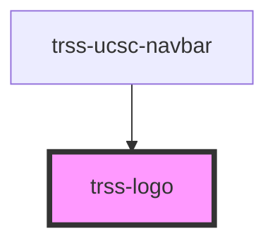

# trss-logo

<!-- Auto Generated Below -->

## Properties

| Property  | Attribute | Description                                | Type     | Default                  |
| --------- | --------- | ------------------------------------------ | -------- | ------------------------ |
| `display` | `display` | Sets the color of the logo (blue or white) | `string` | `undefined`              |
| `link`    | `link`    | The URL target for the logo.               | `string` | `'https://www.ucsc.edu'` |
| `width`   | `width`   | Sets the width of the logo.                | `string` | `undefined`              |

## Dependencies

### Used by

 - [trss-ucsc-navbar](../trss-ucsc-navbar)

### Graph

----------------------------------------------

*Built with [StencilJS](https://stenciljs.com/)*
