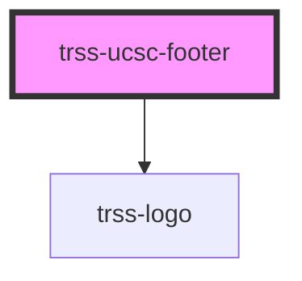

# trss-ucsc-footer

The UCSC footer appears at the absolute bottom of UCSC web pages published by the campus CMS. It contains links our campus requires on all web pages.

You can use a style attribute on the element to set the `--trss-content-width` CSS custom property.

<!-- Auto Generated Below -->

## Properties

| Property | Attribute | Description                                | Type     | Default                               |
| -------- | --------- | ------------------------------------------ | -------- | ------------------------------------- |
| `year`   | `year`    | The numeric year we use for the copyright. | `string` | `new Date().getFullYear().toString()` |

## Dependencies

### Depends on

- [trss-logo](../trss-logo)

### Graph

----------------------------------------------

*Built with [StencilJS](https://stenciljs.com/)*
