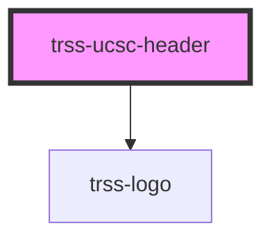

# trss-ucsc-header

The UCSC header appears at the top of UCSC web pages published by the campus CMS. It contains the utility links our visitors use most often, and a configurable search element.  

<!-- Auto Generated Below -->

## Properties

| Property  | Attribute  | Description                                 | Type      | Default     |
| --------- | ---------- | ------------------------------------------- | --------- | ----------- |
| `search`  | `search`   | The URL where search queries should be sent | `string`  | `undefined` |
| `useLogo` | `use-logo` | Whether or not to display the UCSC logo     | `boolean` | `undefined` |

## Dependencies

### Depends on

- [trss-logo](../trss-logo)

### Graph

----------------------------------------------

*Built with [StencilJS](https://stenciljs.com/)*
