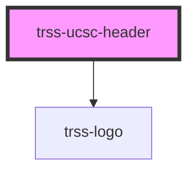

# trss-ucsc-header

The UCSC header appears at the top of UCSC web pages published by the campus CMS. It contains the utility links our visitors use most often, and a configurable search element.

You can use a style attribute on the element to set the `--trss-content-width` CSS custom property.

<!-- Auto Generated Below -->

## Properties

| Property       | Attribute       | Description                                               | Type     | Default     |
| -------------- | --------------- | --------------------------------------------------------- | -------- | ----------- |
| `homeLink`     | `home-link`     | Use "logo" to display UCSC logo or "text" for a text link | `string` | `undefined` |
| `searchAction` | `search-action` | The URL for the search form action attribute              | `string` | `undefined` |
| `searchQuery`  | `search-query`  | The query parameter for the search string                 | `string` | `undefined` |

## Dependencies

### Depends on

- [trss-logo](../trss-logo)

### Graph

----------------------------------------------

*Built with [StencilJS](https://stenciljs.com/)*
