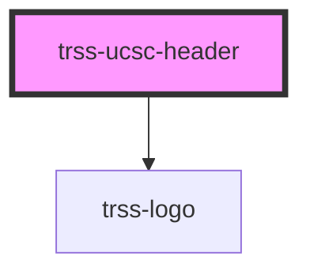

# trss-ucsc-header

The UCSC header appears at the top of UCSC web pages published by the campus CMS. It contains the utility links our visitors use most often, and a configurable search element.

You can use a style attribute on the element to set the `--trss-content-width` CSS custom property.

<!-- Auto Generated Below -->

## Properties

| Property       | Attribute       | Description                  | Type      | Default |
| -------------- | --------------- | ---------------------------- | --------- | ------- |
| `searchAction` | `search-action` | URL for the search action    | `string`  | `'/'`   |
| `searchQuery`  | `search-query`  | Query parameter for search   | `string`  | `'q'`   |
| `useLogo`      | `use-logo`      | Display the UCSC logo        | `boolean` | `true`  |
| `useSearch`    | `use-search`    | Display the UCSC search form | `boolean` | `true`  |

## Dependencies

### Depends on

- [trss-logo](../trss-logo)

### Graph

```mermaid
graph TD;
  trss-ucsc-header --> trss-logo
  style trss-ucsc-header fill:#f9f,stroke:#333,stroke-width:4px
```

----------------------------------------------

*Built with [StencilJS](https://stenciljs.com/)*
