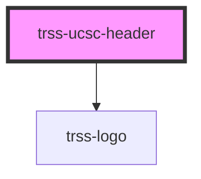

# trss-ucsc-header

The UCSC header appears at the top of UCSC web pages published by the campus CMS. It contains the utility links our visitors use most often, and a configurable search element.

You can use a style attribute on the element to set the `--trss-content-width` CSS custom property.

<!-- Auto Generated Below -->

## Properties

| Property             | Attribute              | Description                                                                                        | Type      | Default                          |
| -------------------- | ---------------------- | -------------------------------------------------------------------------------------------------- | --------- | -------------------------------- |
| `globalSearchAction` | `global-search-action` | URL for the campus-wide search action, used when the search scope selector is set to "All of UCSC" | `string`  | `'https://www.ucsc.edu/search/'` |
| `searchAction`       | `search-action`        | URL for the search action                                                                          | `string`  | `'/'`                            |
| `searchQuery`        | `search-query`         | Query parameter for search                                                                         | `string`  | `'q'`                            |
| `useLogo`            | `use-logo`             | Display the UCSC logo                                                                              | `boolean` | `true`                           |
| `useSearch`          | `use-search`           | Display the UCSC search form                                                                       | `boolean` | `true`                           |
| `useSearchScope`     | `use-search-scope`     | Display a search scope selector ("This site" / "All of UCSC")                                      | `boolean` | `false`                          |

## Dependencies

### Depends on

- [trss-logo](../trss-logo)

### Graph

```mermaid
graph TD;
  trss-ucsc-header --> trss-logo
  style trss-ucsc-header fill:#f9f,stroke:#333,stroke-width:4px
```

----------------------------------------------

*Built with [StencilJS](https://stenciljs.com/)*
