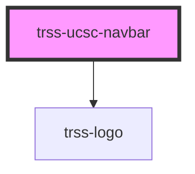

# trss-ucsc-navbar

<!-- Auto Generated Below -->

## Properties

| Property  | Attribute  | Description | Type      | Default     |
| --------- | ---------- | ----------- | --------- | ----------- |
| `search`  | `search`   |             | `string`  | `undefined` |
| `useLogo` | `use-logo` |             | `boolean` | `undefined` |

## Dependencies

### Depends on

- [trss-logo](../trss-logo)

### Graph

----------------------------------------------

*Built with [StencilJS](https://stenciljs.com/)*
